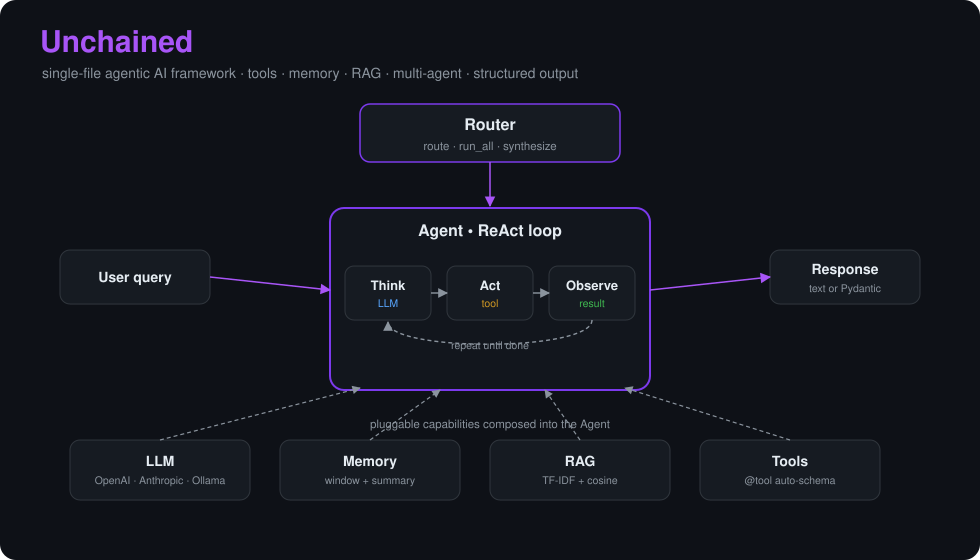

<div align="center">

# ⛓️‍💥 Unchained

**A single-file agentic AI framework.**
Tools, memory, RAG, multi-agent orchestration and structured output — in one file, with two dependencies.

[](https://github.com/NiravRVaghasiya/unchained/actions/workflows/ci.yml)
[](https://www.python.org/)
[](LICENSE)
[](https://mypy-lang.org/)
[](https://github.com/astral-sh/ruff)



</div>

---

## Why Unchained?

Most agent frameworks ask you to learn a mountain of abstractions before you
can print "hello world". Unchained is the opposite: one readable file, two
dependencies, zero magic. Copy `unchained.py` into your project and you are
done.

- **Single-file core** — the whole framework fits in `unchained.py`. No submodules to jump between.
- **Two dependencies** — `requests` + `pydantic`. Nothing else.
- **Provider-agnostic** — the same code runs on OpenAI, Anthropic, a local Ollama model, or any OpenAI-compatible endpoint (Groq, Together, OpenRouter, vLLM, LM Studio, ...). Change one line.
- **No magic** — no metaclasses, no monkey-patching, no hidden global state.
- **Composition over inheritance** — an `Agent` is just an `LLM` plus tools, memory and RAG.

## Why I built this

I wanted to understand agentic systems by building one from first principles
rather than wiring together someone else's abstractions. Unchained is the
result: small enough to read in a single sitting, but complete enough to run a
real multi-agent application (see [PickMyStack](examples/pickmystack/)). It
doubles as a readable reference for how tool-calling, retrieval, memory
compression, and multi-agent routing actually work under the hood.

## Install

```bash
# The whole framework is just two dependencies:
pip install requests pydantic

# ...or install the package with the dev/test extras:
pip install -e ".[dev]"
```

Prefer zero install? Copy `unchained.py` straight into your project — that's the point.

## 30-second tour

```python
from unchained import LLM, Agent, tool

@tool
def add(a: int, b: int) -> int:
    """Add two numbers together."""
    return a + b

agent = Agent(
    LLM(provider="ollama", model="llama3.1"),
    tools=[add],
    system_prompt="You are a precise calculator.",
)

print(agent.run("What is 1234 + 5678?"))
```

Switch to a cloud provider by changing a single argument:

```python
agent = Agent(LLM(provider="openai",    model="gpt-4o-mini"), tools=[add])
agent = Agent(LLM(provider="anthropic", model="claude-3-5-sonnet-20241022"), tools=[add])
```

API keys are read from `OPENAI_API_KEY` / `ANTHROPIC_API_KEY` if you don't pass them explicitly.

### Any OpenAI-compatible endpoint

`provider="openai"` isn't limited to OpenAI itself — pass (or set the env var
for) a different `base_url` and the same code talks to Groq, Together,
OpenRouter, vLLM, LM Studio, or anything else that speaks the OpenAI chat API:

```python
agent = Agent(LLM(provider="openai", model="llama-3.1-70b", base_url="https://api.groq.com/openai"))
```

Or via the environment, with no code change at all:
`OPENAI_BASE_URL`, `ANTHROPIC_BASE_URL`, `OLLAMA_BASE_URL` (see `.env.example`).

## No API key? No problem

`MockLLM` is a deterministic, no-network stand-in for a real provider, so the
examples — and your own tests — run with zero setup:

```python
from unchained import Agent, MockLLM

agent = Agent(MockLLM(reply="Hello from a mock model!"))
print(agent.run("hi"))          # no key, no server, fully offline
```

See the whole loop (tool calling, streaming, structured output) with no setup:

```bash
python examples/quickstart.py
```

Swap `MockLLM(...)` for `LLM(provider=...)` when you're ready for a real model.

## Features

### 🔧 Tools — just decorate a function

The `@tool` decorator introspects the signature, maps type hints to a JSON
schema, and turns the docstring into the description. No boilerplate.

```python
@tool
def get_weather(city: str, units: str = "celsius") -> str:
    """Look up the current weather for a city."""
    ...
```

Beyond `str`/`int`/`float`/`bool`/`list`/`dict`/`Optional[X]`, the schema
builder also understands `Literal[...]`, `Enum` subclasses, and nested
Pydantic models, so the model actually sees the constraint instead of a plain
string:

```python
from typing import Literal

@tool
def set_thermostat(mode: Literal["heat", "cool", "off"], degrees: int) -> str:
    """Set the thermostat mode and target temperature."""
    ...
```

Tools can be `async def` too — `tool.run(...)` drives them to completion, or
await `Agent.arun(...)` to run a whole turn (including async tools) off the
event loop:

```python
@tool
async def fetch_price(ticker: str) -> str:
    """Look up a stock price."""
    ...

price = await Agent(llm, tools=[fetch_price]).arun("What's AAPL trading at?")
```

When a model requests more than one tool call in the same turn, Unchained runs
them concurrently on a thread pool (most tools are I/O-bound), then feeds the
results back in the original order.

### 🧠 Memory — sliding window with compression

```python
from unchained import Memory

memory = Memory(max_messages=20, llm=llm)  # overflow is summarised by the LLM
agent = Agent(llm, memory=memory)
```

When the window fills up, the oldest half is compressed into a running summary
so token usage stays predictable. A message-count cap alone can't promise a
token budget (a handful of very long messages can still overflow the context
window), so pass `max_tokens` too to shrink the window further whenever the
kept messages alone would exceed it (estimated at ~4 chars/token, no tokenizer
dependency):

```python
memory = Memory(max_messages=20, max_tokens=4000, llm=llm)
```

### 📚 RAG — retrieval with zero extra dependencies

TF-IDF with smoothed (sklearn-style) IDF and cosine similarity — accurate even
on a handful of documents, and it runs entirely in memory.

```python
from unchained import RAG

rag = RAG()
rag.add_many([
    "Unchained is a single-file agent framework.",
    "It supports OpenAI, Anthropic and Ollama.",
])
agent = Agent(llm, rag=rag)
print(agent.run("Which providers does Unchained support?"))
```

Need semantic search? Pass `embed_fn=...` (`list[str] -> list[list[float]]`) to
use dense embeddings instead — TF-IDF stays the zero-dependency default:

```python
rag = RAG(embed_fn=my_embedding_model)   # e.g. OpenAI or sentence-transformers
```

### 📦 Structured output — validated with Pydantic

```python
from pydantic import BaseModel

class Recipe(BaseModel):
    title: str
    steps: list[str]
    minutes: int

recipe = agent.run("Give me a quick pasta recipe.", response_format=Recipe)
print(recipe.title, recipe.minutes)   # a real, validated Recipe instance
```

### 🤝 Multi-agent — route or synthesize

```python
from unchained import Router

router = Router(llm, agents=[cost_agent, fit_agent, trend_agent], synthesizer=synth)

router.route("How much will this cost?").run(...)   # pick the best single agent
router.run_all("Compare these options")             # every agent, in parallel
router.synthesize("Recommend a stack for my team")  # run all, then fuse
```

## The agent loop

Every agent runs the classic ReAct cycle until the model stops asking for tools:

```
think (LLM)  ->  act (tool)  ->  observe (result)  ->  repeat
```

## Production features

Small doesn't mean toy. Unchained handles the things that actually bite in production.

### Streaming

```python
for token in agent.stream("Write a haiku about databases."):
    print(token, end="", flush=True)
```

`LLM.stream()` works for all three providers. `Agent.stream()` resolves any tool
calls first, then streams the final answer token by token.

### Async

`Agent.arun()` and `LLM.achat()` let you `await` a run from async code (FastAPI,
aiohttp, ...) without blocking the event loop:

```python
result = await agent.arun("Summarise this ticket.")
```

Under the hood this offloads the (still synchronous, `requests`-based) call to
a worker thread via `asyncio.to_thread` — it keeps your event loop responsive,
but it is not a non-blocking async HTTP client. If you need true async
sockets, wrap a dedicated async HTTP client behind the same `LLM` interface
(see [Extending](#extending)).

### Automatic retries

Rate limits, `5xx`, and dropped connections are retried with exponential backoff
and jitter, honouring `Retry-After`:

```python
llm = LLM(provider="openai", max_retries=3, backoff=0.5)
```

### Response caching

Opt in to memoize identical requests — handy for repeated prompts, tests, and
keeping costs down. The cache is a bounded LRU (evicts the oldest entry past
`cache_size`) with an optional TTL, so a long-running process won't leak
memory indefinitely:

```python
llm = LLM(provider="openai", cache=True, cache_size=256, cache_ttl=300)  # 5-minute TTL
```

### Connection reuse

Each `LLM` instance keeps a persistent `requests.Session`, so repeated calls
reuse the underlying TCP/TLS connection instead of renegotiating one per
request. Call `llm.close()` when you're done with an instance if you want to
release it explicitly (otherwise it's cleaned up like any other object).

### Observability and tracing

Attach callbacks to trace every step, or use the built-in logger:

```python
import logging
from unchained import Agent, LoggingCallback

logging.basicConfig(level=logging.INFO)
agent = Agent(llm, tools=[...], callbacks=[LoggingCallback()])
```

Write your own by subclassing `Callback` (`on_iteration`, `on_llm_call`,
`on_tool_call`, `on_finish`). Callback errors are logged, never fatal.

### Token usage tracking

Usage is normalised across providers and accumulated per agent:

```python
agent.run("Summarise this.")
print(agent.usage)   # {'prompt_tokens': ..., 'completion_tokens': ..., 'total_tokens': ...}
```

### Self-healing structured output

If the model returns JSON that fails validation, the agent feeds the error and
schema back and asks it to fix the output before giving up (`structured_retries`).

### Persistent memory

Swap the in-memory window for a database-backed store — see
[`examples/sqlite_memory.py`](examples/sqlite_memory.py) for a `SQLiteMemory`
that survives restarts and namespaces conversations by session.

## Examples

| Example | What it shows |
|---|---|
| [`examples/quickstart.py`](examples/quickstart.py) | Zero-setup tour (no API key) using `MockLLM` |
| [`examples/researcher.py`](examples/researcher.py) | A web-research agent with a search tool |
| [`examples/coder.py`](examples/coder.py) | Runs Python in an isolated subprocess with a timeout (not a full sandbox) |
| [`examples/data_analyst.py`](examples/data_analyst.py) | CSV analysis with a stats tool |
| [`examples/sqlite_memory.py`](examples/sqlite_memory.py) | Persistent, session-scoped memory backed by SQLite |
| [`examples/pickmystack/`](examples/pickmystack/) | **Flagship** multi-agent app that recommends an AI stack |

### PickMyStack

The flagship demo. Describe your use case and constraints; three specialist
agents (cost, fit, trend) evaluate options in parallel and a synthesizer ranks
the top stacks. Ships with a CLI and a Streamlit UI.

```bash
python -m examples.pickmystack.app "Build a customer-support chatbot" --budget 200 --team 3
# or launch the web UI:
streamlit run examples/pickmystack/ui/app_ui.py
```

<!-- Tip: record a short GIF of the Streamlit UI, save it as docs/assets/pickmystack-ui.gif,
     and uncomment the line below to show it off at the top of this section.
<p align="center"></p>
-->


## Documentation

- **[API reference & docs site](https://niravrvaghasiya.github.io/unchained/)** — built with MkDocs (`pip install -e ".[docs]" && mkdocs serve`)
- [Architecture](docs/ARCHITECTURE.md) — how every piece fits together
- [User Manual](docs/USER_MANUAL.md) — a friendly, non-technical guide
- [Contributing](CONTRIBUTING.md) · [Changelog](CHANGELOG.md) · [Security policy](SECURITY.md)

## Development

```bash
pip install -e ".[dev]"

ruff check .            # lint
ruff format --check .   # formatting
mypy                    # type-check the core
pytest --cov=unchained  # tests + coverage
```

The test suite uses a fake LLM, so it runs fully offline with no API keys. CI
runs all of the above across Python 3.9–3.13 on every push. See
[CONTRIBUTING.md](CONTRIBUTING.md) to get started.

## Extending

Unchained is designed to be extended, not forked:

| Extension | How |
|---|---|
| New tool | `@tool` on any function (sync or async) |
| New LLM provider | add a `_provider()` method to `LLM` |
| OpenAI-compatible provider | reuse `provider="openai"` with a different `base_url` |
| True async HTTP | subclass `LLM` and override `chat()`/`_request()` with an async client |
| Better retrieval | swap `RAG._rebuild_index()` + `search()` |
| Persistent memory | subclass `Memory` — see [`examples/sqlite_memory.py`](examples/sqlite_memory.py) |
| Custom tracing | subclass `Callback` and pass `callbacks=[...]` |
| Custom routing | subclass `Router`, override `route()` |

## License

[MIT](LICENSE)
