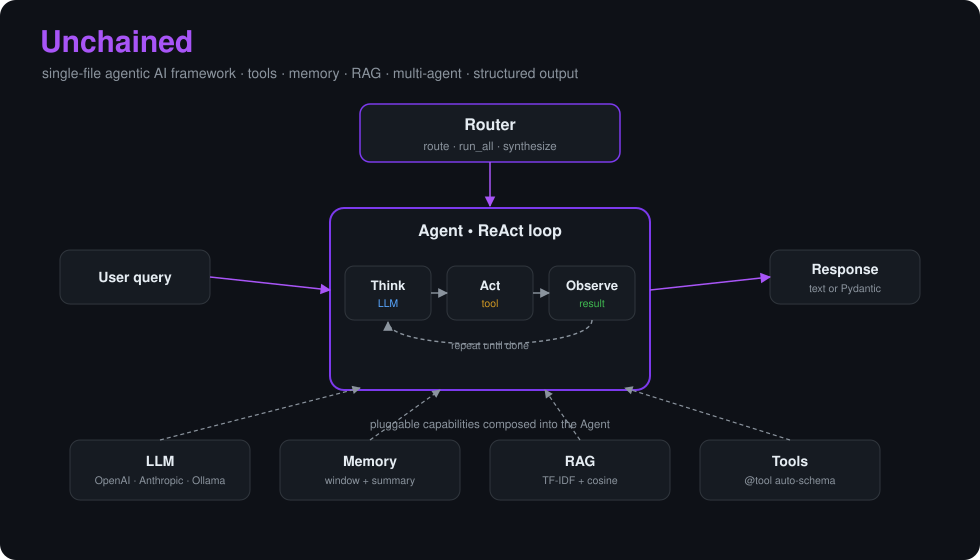

<div align="center">

# ⛓️‍💥 Unchained

**A single-file agentic AI framework.**
Tools, memory, RAG, multi-agent orchestration and structured output — in one file, with two dependencies.

[](https://github.com/NiravRVaghasiya/unchained/actions/workflows/ci.yml)
[](https://www.python.org/)
[](LICENSE)
[](https://mypy-lang.org/)
[](https://github.com/astral-sh/ruff)



</div>

---

## Why Unchained?

Most agent frameworks ask you to learn a mountain of abstractions before you
can print "hello world". Unchained is the opposite: one readable file, two
dependencies, zero magic. Copy `unchained.py` into your project and you are
done.

- **Single-file core** — the whole framework fits in `unchained.py`. No submodules to jump between.
- **Two dependencies** — `requests` + `pydantic`. Nothing else.
- **Provider-agnostic** — the same code runs on OpenAI, Anthropic, a local Ollama model, or any OpenAI-compatible endpoint (Groq, Together, OpenRouter, vLLM, LM Studio, ...). Change one line.
- **No magic** — no metaclasses, no monkey-patching, no hidden global state.
- **Composition over inheritance** — an `Agent` is just an `LLM` plus tools, memory and RAG.

## Why I built this

I wanted to understand agentic systems by building one from first principles
rather than wiring together someone else's abstractions. Unchained is the
result: small enough to read in a single sitting, but complete enough to run a
real multi-agent application (see [PickMyStack](examples/pickmystack/)). It
doubles as a readable reference for how tool-calling, retrieval, memory
compression, and multi-agent routing actually work under the hood.

## Install

```bash
# The whole framework is just two dependencies:
pip install requests pydantic

# ...or install the package with the dev/test extras:
pip install -e ".[dev]"
```

Prefer zero install? Copy `unchained.py` straight into your project — that's the point.

## 30-second tour

```python
from unchained import LLM, Agent, tool


@tool
def add(a: int, b: int) -> int:
    """Add two numbers together."""
    return a + b


agent = Agent(
    LLM(provider="ollama", model="llama3.1"),
    tools=[add],
    system_prompt="You are a precise calculator.",
)

print(agent.run("What is 1234 + 5678?"))
```

Switch to a cloud provider by changing a single argument:

```python
agent = Agent(LLM(provider="openai", model="gpt-4o-mini"), tools=[add])
agent = Agent(LLM(provider="anthropic", model="claude-3-5-sonnet-20241022"), tools=[add])
```

API keys are read from `OPENAI_API_KEY` / `ANTHROPIC_API_KEY` if you don't pass them explicitly.

### Any OpenAI-compatible endpoint

`provider="openai"` isn't limited to OpenAI itself — pass (or set the env var
for) a different `base_url` and the same code talks to Groq, Together,
OpenRouter, vLLM, LM Studio, or anything else that speaks the OpenAI chat API:

```python
agent = Agent(LLM(provider="openai", model="llama-3.1-70b", base_url="https://api.groq.com/openai"))
```

Or via the environment, with no code change at all:
`OPENAI_BASE_URL`, `ANTHROPIC_BASE_URL`, `OLLAMA_BASE_URL` (see `.env.example`).

## No API key? No problem

`MockLLM` is a deterministic, no-network stand-in for a real provider, so the
examples — and your own tests — run with zero setup:

```python
from unchained import Agent, MockLLM

agent = Agent(MockLLM(reply="Hello from a mock model!"))
print(agent.run("hi"))  # no key, no server, fully offline
```

See the whole loop (tool calling, streaming, structured output) with no setup:

```bash
python examples/quickstart.py
```

Swap `MockLLM(...)` for `LLM(provider=...)` when you're ready for a real model.

## Features

### 🔧 Tools — just decorate a function

The `@tool` decorator introspects the signature, maps type hints to a JSON
schema, and turns the docstring into the description. No boilerplate.

```python
@tool
def get_weather(city: str, units: str = "celsius") -> str:
    """Look up the current weather for a city."""
    ...
```

Beyond `str`/`int`/`float`/`bool`/`list`/`dict`/`Optional[X]`, the schema
builder also understands `Literal[...]`, `Enum` subclasses, and nested
Pydantic models, so the model actually sees the constraint instead of a plain
string:

```python
from typing import Literal


@tool
def set_thermostat(mode: Literal["heat", "cool", "off"], degrees: int) -> str:
    """Set the thermostat mode and target temperature."""
    ...
```

**That schema is what the model is shown — and arguments are validated
independently of it before your function runs.** The schema is advice the
model may ignore; what actually arrives is checked against the Python
signature (using Pydantic, already a dependency) and normalised to the types
you annotated. Inside `set_thermostat`, `degrees` is an `int` even if the
model sent `"21"`.

A call of `{"mode": "warm", "degrees": "hot"}` never reaches the function.
The model gets an observation naming each field and the rule it broke, so it
can correct itself on the next turn:

```
Error: tool 'set_thermostat' got invalid arguments - mode: Input should be
'heat', 'cool' or 'off'; degrees: Input should be a valid integer, unable to
parse string as an integer
```

Rejected: missing required arguments, wrong types, malformed nested
structures, and unknown argument names (unless the tool takes `**kwargs`).
Nested Pydantic models are validated all the way down, and errors point at the
exact path — `person.address.zip`.

Validation errors never repeat the offending *value*, only its location and
the rule. That text goes to the model, into memory, and into the audit log, so
a tool taking a token or a customer record cannot leak it by failing
validation.

Two notes on normalisation: an `Enum`-annotated parameter receives the enum
member (`Color.red`, not `"red"`), and a parameter with no annotation accepts
anything, since the plain Python function would too.

Tools can be `async def` too — `tool.run(...)` drives them to completion, or
await `Agent.arun(...)` to run a whole turn (including async tools) off the
event loop:

```python
@tool
async def fetch_price(ticker: str) -> str:
    """Look up a stock price."""
    ...


price = await Agent(llm, tools=[fetch_price]).arun("What's AAPL trading at?")
```

When a model requests more than one tool call in the same turn, Unchained runs
them concurrently on a thread pool (most tools are I/O-bound), then feeds the
results back in the original order. How many calls arrive in a turn is decided
by the model, so the pool is capped — `Agent(max_tool_workers=8)` — rather than
sized to the request. Extra calls queue and still run; only concurrency is
bounded.

Concurrency is fine until a tool races with itself. Mark those `exclusive`:

```python
@tool(concurrency="exclusive", side_effects=True)
def append_ledger(entry: str) -> str:
    """Two of these at once would interleave, so it runs alone."""
```

An exclusive call **runs on its own** — nothing else from that turn runs while
it does. Calls keep the order the model asked for, with consecutive parallel
ones grouped:

```
model asks for:  [read, read, append_ledger, read, append_ledger]
runs as:         {read, read} → append_ledger → read → append_ledger
```

A turn of only parallel tools is a single group, which is exactly what every
tool did before this existed — so nothing changes unless you opt in.

> **`side_effects=True` does not serialize anything.** It describes a tool to
> your `ToolPolicy` and to the audit log. If two concurrent calls would race,
> you must also set `concurrency="exclusive"`.

**The framework cannot infer dependencies, and does not pretend to.** A model
emits a *list* of calls it wants; nothing in the protocol says the second
depends on the first, and no amount of inspection can recover an ordering the
model never expressed. `exclusive` is the one thing you can declare: *this
tool must not overlap*. If two different tools must run in a particular order,
that is a relationship only you know — express it in the tools themselves (one
tool that does both steps), not by hoping the scheduler guesses.

The guarantee is also **per turn**. Two exclusive calls in the same turn never
overlap; the same tool called from two concurrent sessions still can, because
those are separate runs. For process-wide exclusion, take a lock inside the
tool.

### ⏱️ Tool timeouts — bounding the wait, not the work

An LLM call has a timeout; a Python tool can block forever. Give a tool a
budget, or set a default for all of them:

```python
@tool(timeout=10)
def fetch_data(url: str) -> str:
    """The agent waits 10s, then gives up on it."""


agent = Agent(llm, tools=[fetch_data], tool_timeout=30)  # default for tools
```

A tool's own `timeout` wins over the agent's default. `None` (the default)
means wait forever, exactly as before. On overrun the agent stops waiting and
the model receives an ordinary tool error, so the loop continues:

```
Error: tool 'fetch_data' did not finish within 10s and was abandoned; it may
still be running, so treat any side effect as unknown rather than as not
having happened
```

**Be clear about what this does not do.** Python cannot cancel a running
thread, and Unchained does not pretend otherwise:

- The tool keeps running after the timeout. It may still complete — and if it
  has side effects, **you do not know whether they happened.** Treat the
  outcome as unknown, not as failed.
- The abandoned thread is not reclaimed until the call ends. Because executor
  threads are not daemons, a tool that hangs forever can delay interpreter
  exit.
- **Hard cancellation needs process isolation.** Run the work in a subprocess
  and kill it — see [`examples/coder.py`](examples/coder.py). A thread timeout
  is a liveness guard for the agent loop, not a containment boundary.
- **A timeout does not abort a socket read.** HTTP tools still need their own
  network timeout: `requests.get(url, timeout=20)`. Without one the request
  can block for a very long time; the tool timeout frees the agent but leaves
  the request running and holding a connection.

Concurrent calls each get their own budget, so one hanging tool does not delay
its siblings or the turn.

### 💰 Run budgets — making a run's cost predictable

Individual limits stop individual things. A budget bounds a whole run:

```python
from unchained import Agent, Budget, BudgetExceededError

agent = Agent(
    llm,
    tools=[...],
    budget=Budget(
        max_tool_calls=20,
        max_total_tokens=50_000,
        max_tool_output=200_000,
        timeout=60,
    ),
)

try:
    answer = session.run("research this thoroughly")
except BudgetExceededError as exc:
    print(exc.limit_name, exc.limit, exc.used)
```

| Budget | Bounds | On exhaustion |
|---|---|---|
| `max_iterations` | think/act cycles | **forces a final answer** (no raise) |
| `max_tool_calls` | tool calls in the run | `ToolCallBudgetExceeded` |
| `max_total_tokens` | prompt + completion tokens | `TokenBudgetExceeded` |
| `max_tool_output` | total characters of tool output | `ToolOutputBudgetExceeded` |
| `timeout` | wall-clock seconds | `TimeBudgetExceeded` |
| `max_cost` | estimated spend | `CostBudgetExceeded` |

All subclass `BudgetExceededError`, and each carries `.limit_name`, `.limit`
and `.used`.

**`max_iterations` is the exception that does not raise.** Running out of
turns ends with one final call and an answer, exactly as it did before
budgets existed — ending a turn with nothing is worse than one more call. It
defaults to the agent's own `max_iterations`, so existing agents are
unchanged.

**Budgets are per run**, not per session: a ten-turn conversation gets the
budget ten times. Lifetime token accounting is `session.usage`, which keeps
accumulating. A session can carry its own budget, so one agent can serve
callers on different allowances:

```python
agent.session(budget=Budget(max_tool_calls=5))  # overrides the agent's
```

**No tool call escapes the budget.** It is claimed on the single path every
model-requested call takes — before the tool is located or authorized — so
unknown and policy-denied calls count too.

#### Reading what a run spent

`session.last_run` holds the accounting, and stays there afterwards —
including when a budget stopped the run:

```python
session.last_run.snapshot()
# {'iterations': 3, 'tool_calls': 7, 'tool_output_chars': 4120,
#  'usage': {...}, 'elapsed': 2.41, 'estimated_cost': 0.0032,
#  'cost_is_complete': True, 'exceeded': None}
```

#### Cost, honestly

Unchained ships **no price table**. Published prices change, and a table
baked into this file would quietly go stale — a cost cap computed from stale
numbers is worse than no cap. You supply the rates, per 1M tokens:

```python
Budget(max_cost=0.50, pricing={"gpt-4o-mini": (0.15, 0.60)})
```

- `Budget(max_cost=...)` **without** `pricing` raises at construction.
- A model missing from `pricing` while `max_cost` is set raises
  `CostBudgetExceeded` rather than costing it as zero — a cap that cannot be
  computed cannot be enforced.
- With no cap, an unpriced call just sets `cost_is_complete = False`.
- The figure is `estimated_cost`, derived from the provider's own token
  counts. It is an estimate, never an invoice.

Budgets are checked before spending, but a call's cost is not known until it
returns — so the last call can carry the total slightly past a limit, and the
run stops immediately after. This is runtime governance, not billing.

### 📏 Tool output limits — bounding what reaches the context

A tool can return megabytes. That overflows the context window, costs money
every turn it stays in the transcript, and grows memory. Give a tool a budget,
or set a default:

```python
@tool(max_output_size=8_000)
def read_log(path: str) -> str:
    """At most 8,000 characters reach the model."""


agent = Agent(llm, tools=[read_log], max_tool_output_size=20_000)
```

A tool's own `max_output_size` wins over the agent's default; `None` (the
default) means unbounded, exactly as before. The budget is applied inside
`Agent._execute`, **before** the result enters memory, reaches a provider, or
is shown to a callback — there is no path where the full text gets through.

**Nothing is truncated silently.** An oversized result keeps its first `n`
characters and gains a note:

```
[output truncated: 8,000 of 1,250,000 characters shown for tool 'read_log']
```

**JSON is never silently corrupted.** If the full result was valid JSON, the
note says so and warns that the fragment will not parse — because a model
handed JSON will otherwise try:

```
... The full result was valid JSON; this fragment is cut mid-structure and
will not parse.
```

Structured output that *fits* is passed through byte-for-byte, so a JSON tool
under its budget still returns parseable JSON.

The budget counts **characters, not bytes**. Python strings are sequences of
code points, so a slice can never split one and produce invalid text — 40 CJK
characters cost 40, not the 120 bytes they occupy. A multi-character emoji
sequence can be split, which is cosmetic. Characters also line up with
`Memory(max_tokens=...)`, which estimates tokens the same way.

`ToolOutputTruncated` carries the details (`.metadata` is a plain, JSON-safe
dict) if you want to log or alert on truncation. It is not an exception — the
tool succeeded, and a shortened result is still useful.

> **This is a context and cost boundary, not a security sandbox.** It limits
> what a tool *sends onward*; it does not stop a tool reading, computing or
> transmitting anything, and a secret inside the retained prefix is retained.
> To contain a hostile tool you need process isolation and a policy — see
> [`examples/coder.py`](examples/coder.py) and
> [Tool authorization](#-tool-authorization--a-policy-layer-not-a-prompt).

### 🧱 Trust boundaries — retrieved and returned text is data

A retrieved document and a tool result are **not** instructions. Both are
fenced with a random per-agent marker before they reach a provider, and any
occurrence of that marker is stripped from the text, so the content cannot
close its own block:

```
<<document-9f2a1c4b7e8d0a35>>
[score=0.87]
...retrieved text...
<</document-9f2a1c4b7e8d0a35>>

what is my balance?
```

The conversation summary is fenced too — it is written by the model from
earlier turns and spliced into the *system* message, so unfenced it is a path
from a tool result into your instructions.

Retrieved documents are stored beside the user's turn rather than spliced
into it, so `session.memory` records what the user actually said.

> **This does not solve prompt injection, and no system prompt does.** A
> persuasive document may still talk a model into something you did not want.
> Fencing means the model is *told* where the boundary is and the data cannot
> *move* it. The boundary that holds is in Python: `permissions` are a
> frozenset fixed at decoration, `ToolPolicy` sees the tool, the arguments and
> a context built from your code — never from retrieved or returned text — and
> approval is your callback. Assume the model will eventually request the
> wrong tool, and make the policy refuse it.
>
> See [SECURITY.md](SECURITY.md) for the full trust ladder and its limits.

### 👥 Sessions — one agent, many conversations

An `Agent` is configuration and behaviour: the LLM, the tools, the prompt, the
policy. A **`Session`** is one conversation's state: its memory, its token
counters, its metadata. Build the agent once and give every user a session:

```python
agent = Agent(llm, tools=[...])  # build once, share freely

alice = agent.session(metadata={"user": "alice"})
bob = agent.session(metadata={"user": "bob"})

alice.run("my name is Alice")
bob.run("what is my name?")  # cannot see Alice's history
```

That makes an agent safe to hold in a module-level variable and serve from many
request handlers at once. The isolation is structural, not lock-based: each
session owns its own `Memory` and usage counters, and no conversational state
lives on the Agent, so two sessions have nothing to contend over.

```python
alice.usage  # {'prompt_tokens': ..., ...} for this conversation only
alice.reset()  # start this conversation over
```

**`agent.run(...)` still works** and is unchanged:

```python
agent = Agent(llm)
agent.run("hello")
agent.run("what did I just say?")  # remembers - one persistent conversation
```

It uses a single **persistent default session**, created on first use and
reused for the life of the agent — `agent.memory` and `agent.usage` are that
session's. Because it persists, `agent.run()` is for single-conversation
scripts; serving several users means one session each. `agent.reset()` clears
the default conversation and leaves other sessions alone.

Sessions get their memory from `memory_factory`, so configuration carries into
every conversation without any two sharing an instance:

```python
agent = Agent(llm, memory_factory=lambda: Memory(max_messages=50))

# ...or hand one session a specific store, e.g. for per-user persistence:
session = agent.session(memory=SQLiteMemory(session_id=user_id))
```

Three things are deliberately shared by every session of an agent, because
they are resources rather than conversation state: the `llm` (its connection
pool and response cache), the `rag` knowledge base, and Agent-level
`callbacks`. Pass `agent.session(callbacks=[...])` for a sink scoped to one
conversation. A single `Session` is one conversation, so it is not itself
meant to be driven by two threads at once.

`Router` gives every agent a fresh session per dispatch, so concurrent
`run_all` calls never land in the same agent's history. See
[`examples/sessions.py`](examples/sessions.py).

### 🔒 Tool authorization — a policy layer, not a prompt

A model asking for a tool is a *request*, not a decision. Unchained resolves
that request in Python, before the function runs — never by telling the model
which tools are safe, which is advice, not a boundary.

Tools carry optional metadata. It is never shown to the model:

```python
@tool
def lookup_order(order_id: str) -> str:
    """Read-only: needs no permission, changes nothing."""


@tool(permissions={"billing:write"}, side_effects=True)
def apply_refund(order_id: str, amount: float) -> str:
    """Side-effecting: gated on a permission the agent must be granted."""


@tool(permissions={"account:delete"}, requires_approval=True, side_effects=True)
def delete_account(customer: str) -> str:
    """Destructive: a human confirms every call."""
```

A policy decides; the application, not the model, answers approval requests:

```python
from unchained import Agent, PermissionPolicy

agent = Agent(
    llm,
    tools=[lookup_order, apply_refund, delete_account],
    policy=PermissionPolicy(granted={"billing:write"}),
    approve=lambda request: input(f"run {request['tool']}{request['arguments']}? ") == "y",
)
```

`lookup_order` runs. `apply_refund` runs. `delete_account` is refused — and
would still be refused if you granted `account:delete` but wired up no
approver, because an unanswerable question is a refusal, not a pass.

Every model-requested call takes the same path, with no way around it:

```
locate tool → validate arguments → policy.authorize() → approval → execute → audit
```

A refusal comes back to the model as an observation, so it learns and can try
something else rather than crashing the run. Every decision is auditable:

```python
class AuditLog(Callback):
    def on_tool_audit(self, event):  # decision, tool, arguments, reason, permissions
        log.info("%(decision)s %(tool)s", event)
```

Write your own rules by subclassing `ToolPolicy` — raise
`ToolAuthorizationError` to deny:

```python
class BusinessHoursOnly(ToolPolicy):
    def authorize(self, tool, arguments, context):
        if tool.side_effects and not is_working_hours():
            raise ToolAuthorizationError("no writes outside business hours")
        super().authorize(tool, arguments, context)
```

For a rule that depends on the arguments, put it on the tool itself:

```python
@tool(allowed=lambda arguments, context: arguments["path"].startswith("/safe/"))
def read_file(path: str) -> str: ...
```

With no `policy=`, an agent behaves exactly as it did before this existed:
everything it was given is allowed. The boundary is always there; its default
answer is yes. See [`examples/policy.py`](examples/policy.py) for a runnable
walkthrough, and [SECURITY.md](SECURITY.md) for what is and isn't enforced.

### 🧠 Memory — sliding window with compression

```python
from unchained import Memory

memory = Memory(max_messages=20, llm=llm)  # overflow is summarised by the LLM
agent = Agent(llm, memory=memory)
```

When the window fills up, the oldest half is compressed into a running summary
so token usage stays predictable. A message-count cap alone can't promise a
token budget (a handful of very long messages can still overflow the context
window), so pass `max_tokens` too to shrink the window further whenever the
kept messages alone would exceed it (estimated at ~4 chars/token, no tokenizer
dependency):

```python
memory = Memory(max_messages=20, max_tokens=4000, llm=llm)
```

### 📚 RAG — retrieval with zero extra dependencies

TF-IDF with smoothed (sklearn-style) IDF and cosine similarity — accurate even
on a handful of documents, and it runs entirely in memory.

```python
from unchained import RAG

rag = RAG()
rag.add_many(
    [
        "Unchained is a single-file agent framework.",
        "It supports OpenAI, Anthropic and Ollama.",
    ]
)
agent = Agent(llm, rag=rag)
print(agent.run("Which providers does Unchained support?"))
```

Need semantic search? Pass `embed_fn=...` (`list[str] -> list[list[float]]`) to
use dense embeddings instead — TF-IDF stays the zero-dependency default:

```python
rag = RAG(embed_fn=my_embedding_model)  # e.g. OpenAI or sentence-transformers
```

**Inputs are validated, because the failures here are silent ones.** A vector
of the wrong width used to be zipped against a longer one and scored a perfect
1.0; a negative `top_k` sliced the ranked list from the end and returned
everything *except* the best match. So:

- `embed_fn` must return exactly one vector per text, in order.
- The index fixes its dimension on the first vector it accepts; every later
  vector — document or query — must match. `rag.dimension` reports it.
- Vectors must be non-empty and finite. A **zero vector is fine** — some
  models emit one for input they can't represent — and scores 0.0.
- Documents must be non-empty strings; `top_k` must be an integer ≥ 1.
- **Nothing is stored until all of it validates**, so a failing `embed_fn`
  leaves the index exactly as it was rather than half-added.

In TF-IDF mode a query with no indexable tokens (`""`, `"!!!"`) returns
nothing. Having nothing to search *with* is different from having searched and
found nothing similar, and returning arbitrary documents scored 0.0 only looks
like a result.

Duplicate documents are kept rather than merged — the same text can
legitimately arrive twice from different sources — and equal scores keep
insertion order.

### 📦 Structured output — validated with Pydantic

```python
from pydantic import BaseModel


class Recipe(BaseModel):
    title: str
    steps: list[str]
    minutes: int


recipe = agent.run("Give me a quick pasta recipe.", response_format=Recipe)
print(recipe.title, recipe.minutes)  # a real, validated Recipe instance
```

### 🤝 Multi-agent — route or synthesize

```python
from unchained import Router

router = Router(llm, agents=[cost_agent, fit_agent, trend_agent], synthesizer=synth)

router.route("How much will this cost?").run(...)  # pick the best single agent
router.run_all("Compare these options")  # every agent, in parallel
router.synthesize("Recommend a stack for my team")  # run all, then fuse
```

**Routing fails closed.** Agents differ in the tools — and so the privileges —
they carry, so picking the wrong one is an authorization mistake, not just a
quality one.

The decision is asked for as JSON, constrained to the registered agent names,
and then **checked against the registry in Python**. The prompt is where the
model is told what is allowed; the lookup is what enforces it — nothing the
model writes can name an agent the router does not hold.

A decision is valid only if it identifies exactly one registered agent.
Everything else raises `RoutingError`: an empty reply, whitespace, a refusal,
a hallucinated name, malformed JSON, or a reply naming two agents. Ambiguity
is a failure, not a contest — it is never broken by order or preference.

```python
from unchained import RoutingError

try:
    agent = router.route(query)
except RoutingError:
    ...  # ask the user, or refuse
```

Prefer a default destination? Name it, and the choice stays visible in the code:

```python
router = Router(llm, agents=[...], fallback=triage_agent)
```

Agent names are validated when the `Router` is built: a blank name, or two
that collide once case and spacing are normalised, raises immediately. Both
used to be silent — a blank-named agent was simply unreachable forever, and
one of two identically-named agents always won.

Text replies are still accepted for models that will not emit JSON: a bare
name, or a name appearing as a *contiguous* run of words ("the best agent is
cost"). That is exact containment, not fuzzy matching — `fit` does not match
"profit", and a two-word name does not match a reply that uses both words
apart. What text matching cannot see is *sense*: prose mentioning one agent
in order to reject it ("not cost") reads as choosing it. Pass `strict=True`
to refuse prose entirely and accept only structured or bare-name replies:

```python
router = Router(llm, agents=[...], strict=True)
```

## The agent loop

Every agent runs the classic ReAct cycle until the model stops asking for tools:

```
think (LLM)  ->  act (tool)  ->  observe (result)  ->  repeat
```

## Production features

Small doesn't mean toy. Unchained handles the things that actually bite in production.

### Streaming

```python
for token in agent.stream("Write a haiku about databases."):
    print(token, end="", flush=True)
```

`LLM.stream()` works for all three providers. `Agent.stream()` resolves any tool
calls first, then streams the final answer token by token.

### Async

`Agent.arun()` and `LLM.achat()` let you `await` a run from async code (FastAPI,
aiohttp, ...) without blocking the event loop:

```python
result = await agent.arun("Summarise this ticket.")
```

Under the hood this offloads the (still synchronous, `requests`-based) call to
a worker thread via `asyncio.to_thread` — it keeps your event loop responsive,
but it is not a non-blocking async HTTP client. If you need true async
sockets, wrap a dedicated async HTTP client behind the same `LLM` interface
(see [Extending](#extending)).

### Automatic retries

Rate limits, `5xx`, and dropped connections are retried with exponential backoff
and jitter, honouring `Retry-After`:

```python
llm = LLM(provider="openai", max_retries=3, backoff=0.5)
```

### Response caching

Opt in to memoize identical requests — handy for repeated prompts, tests, and
keeping costs down. The cache is a bounded LRU (evicts the oldest entry past
`cache_size`) with an optional TTL, so a long-running process won't leak
memory indefinitely:

```python
llm = LLM(provider="openai", cache=True, cache_size=256, cache_ttl=300)  # 5-minute TTL
llm.clear_cache()  # invalidate everything
```

**Tool-call responses are not cached.** A plain answer is a fact worth
remembering; a response asking to call `refund(order_id="A-1")` is a *decision
to act*. Caching that would replay the decision on the next identical prompt —
the same refund, the same email — without the model being asked again, and
without a request going out to reveal it. The world the decision was made in
has moved on; the cached answer has not.

So `cache=True` means `"final_only"`: plain answers are stored, tool-call
responses are returned to the caller but never kept.

```python
LLM(provider="openai", cache=True)  # "final_only" — the default
LLM(provider="openai", cache="none")  # off
LLM(provider="openai", cache="all")  # also cache tool-call decisions
```

Use `"all"` only when every tool in play is read-only. Even then the cache
only decides *what the model is taken to have said* — it never executes
anything. Every tool call still passes the [tool policy](#-tool-authorization--a-policy-layer-not-a-prompt)
and any approval hook before it runs, cached or fresh.

The cache key covers everything that can change the answer: provider, base
URL, model, temperature, `max_tokens`, the messages, the **full tool schemas**,
and the response-format schema. Tools are keyed by schema rather than name
because two tools can share a name and differ completely — a `search` over
public docs and a `search` over internal records — and response formats are
keyed by schema because unrelated models are so often both called `Item`.

### Connection reuse

Each `LLM` instance keeps a persistent `requests.Session`, so repeated calls
reuse the underlying TCP/TLS connection instead of renegotiating one per
request. Call `llm.close()` when you're done with an instance if you want to
release it explicitly (otherwise it's cleaned up like any other object).

### Observability and tracing

Attach callbacks to trace every step, or use the built-in logger:

```python
import logging
from unchained import Agent, LoggingCallback

logging.basicConfig(level=logging.INFO)
agent = Agent(llm, tools=[...], callbacks=[LoggingCallback()])
```

Write your own by subclassing `Callback` (`on_iteration`, `on_llm_call`,
`on_tool_call`, `on_finish`). Callback errors are logged, never fatal.

#### Structured events

For logging, metrics and debugging, subscribe to the event stream instead of
overriding a method per hook:

```python
stop = agent.subscribe(lambda event: log.info("%s", event))
# AgentStarted run=09a56d21a187 model=gpt-4o-mini
# LLMFinished  run=09a56d21a187 model=gpt-4o-mini 412ms tokens=25
# ToolStarted  run=09a56d21a187 tool=search
# ToolFinished run=09a56d21a187 tool=search 88ms
# AgentFinished run=09a56d21a187 1204ms tokens=63
stop()
```

Each `AgentEvent` is a frozen record with `event_type`, `run_id`,
`session_id`, `agent`, `timestamp`, and — where they apply — `duration`,
`model`, `tool`, `tool_call_id`, `usage` and `metadata`. `as_dict()` gives you
a JSON-safe dict for structured logging.

| Event | When |
|---|---|
| `AgentStarted` / `AgentFinished` / `AgentFailed` | a run begins, answers, or raises |
| `AgentIteration` | a think/act cycle begins |
| `LLMStarted` / `LLMFinished` | a provider request goes out and comes back |
| `ToolStarted` / `ToolFinished` | an authorized tool call runs |
| `ToolFailed` | a call produced no result |

`ToolFailed` can arrive with no preceding `ToolStarted` — a call refused
before it ran never started. `metadata["reason"]` says which stage refused it:
`unknown_tool`, `invalid_arguments`, `denied`, `approval_denied`, `timeout` or
`raised`. That distinction is the point: "the tool broke" and "the tool was
not allowed to run" are different numbers on a dashboard.

**`run_id` is unique per run**, so events from concurrent runs never
interleave ambiguously; `session_id` is stable across a conversation.

> **Payloads are excluded by default.** Prompts, tool arguments, tool results
> and the final answer are where personal data and credentials live, and an
> event stream usually ends up in a log aggregator. Events carry shapes and
> sizes instead — message counts, character counts. Pass
> `Agent(event_payloads=True)` to include the content itself, deliberately.

Handler errors are logged and swallowed, so a broken metrics sink never costs
you an answer the model already produced. In tests that hides bugs, so
`Agent(strict_callbacks=True)` re-raises instead.

`Callback` also gained `on_event`, so a subclass can take the structured
stream and the older hooks together. Existing subclasses are unaffected — the
base `on_event` is a no-op.

### One response shape, whoever answered

Every provider is reduced to the same `LLMResponse`, so nothing downstream
needs to know which one replied:

```python
response = llm.chat([{"role": "user", "content": "hi"}])

response.content  # the assistant text
response.tool_calls  # [{"name", "arguments", "id"}], arguments parsed
response.usage  # prompt_tokens / completion_tokens / total_tokens
response.finish_reason  # "stop" | "tool_calls" | "length" | "content_filter"
response.provider  # "openai" | "anthropic" | "ollama"
response.model  # what actually answered: "gpt-4o-mini-2024-07-18"
response.request_id  # for quoting to a provider's support
response.metadata  # provider-specific extras, opaque to the agent loop
```

**`finish_reason` is worth having.** Anthropic's `max_tokens`, OpenAI's
`length` and Ollama's `done_reason` all become `"length"`, and
`response.truncated` is True — which is otherwise invisible, so an agent
would treat a half-finished answer as a complete one. A reason we don't
recognise is passed through unchanged rather than forced into a bucket, and
the provider's own wording is always kept in `metadata["raw_finish_reason"]`.

Provider-specific detail is preserved rather than discarded, but confined to
`metadata` — OpenAI's `system_fingerprint`, Ollama's timings, Anthropic's
`stop_sequence`, and the `endpoint` that answered (useful when
`provider="openai"` is pointed at Groq or vLLM). Nothing in the agent loop
reads it; it's there for your logs.

The response still behaves like the plain dict it replaced —
`response["content"]`, `response.get("usage")` — so existing code and test
doubles that return a bare dict keep working. It is frozen, so a handler
can't rewrite a reply another handler is about to see.

### Token usage tracking

Usage is normalised across providers and accumulated per agent:

```python
agent.run("Summarise this.")
print(agent.usage)  # {'prompt_tokens': ..., 'completion_tokens': ..., 'total_tokens': ...}
```

### Self-healing structured output

If the model returns JSON that fails validation, the agent feeds the error and
schema back and asks it to fix the output before giving up (`structured_retries`).

### Persistent memory

Swap the in-memory window for a database-backed store — see
[`examples/sqlite_memory.py`](examples/sqlite_memory.py) for a `SQLiteMemory`
that survives restarts and namespaces conversations by session.

## Examples

| Example | What it shows |
|---|---|
| [`examples/quickstart.py`](examples/quickstart.py) | Zero-setup tour (no API key) using `MockLLM` |
| [`examples/researcher.py`](examples/researcher.py) | A web-research agent with a search tool |
| [`examples/coder.py`](examples/coder.py) | Runs Python in an isolated subprocess with a timeout (not a full sandbox) |
| [`examples/data_analyst.py`](examples/data_analyst.py) | CSV analysis with a stats tool |
| [`examples/sqlite_memory.py`](examples/sqlite_memory.py) | Persistent, session-scoped memory backed by SQLite |
| [`examples/policy.py`](examples/policy.py) | Read-only, side-effecting and approval-required tools under a `ToolPolicy` |
| [`examples/sessions.py`](examples/sessions.py) | One agent serving many users concurrently, one `Session` each |
| [`examples/pickmystack/`](examples/pickmystack/) | **Flagship** multi-agent app that recommends an AI stack |

### PickMyStack

The flagship demo. Describe your use case and constraints; three specialist
agents (cost, fit, trend) evaluate options in parallel and a synthesizer ranks
the top stacks. Ships with a CLI and a Streamlit UI.

```bash
python -m examples.pickmystack.app "Build a customer-support chatbot" --budget 200 --team 3
# or launch the web UI:
streamlit run examples/pickmystack/ui/app_ui.py
```

<!-- Tip: record a short GIF of the Streamlit UI, save it as docs/assets/pickmystack-ui.gif,
     and uncomment the line below to show it off at the top of this section.
<p align="center"></p>
-->


## Documentation

- **[API reference & docs site](https://niravrvaghasiya.github.io/unchained/)** — built with MkDocs (`pip install -e ".[docs]" && mkdocs serve`)
- [Architecture](docs/ARCHITECTURE.md) — how every piece fits together
- [User Manual](docs/USER_MANUAL.md) — a friendly, non-technical guide
- [Contributing](CONTRIBUTING.md) · [Changelog](CHANGELOG.md) · [Security policy](SECURITY.md)

## Development

```bash
pip install -e ".[dev]"

ruff check .            # lint
ruff format --check .   # formatting
mypy                    # type-check the core
pytest --cov=unchained  # tests + coverage
```

The test suite uses a fake LLM, so it runs fully offline with no API keys. CI
runs all of the above across Python 3.9–3.13 on every push. See
[CONTRIBUTING.md](CONTRIBUTING.md) to get started.

## Extending

Unchained is designed to be extended, not forked:

| Extension | How |
|---|---|
| New tool | `@tool` on any function (sync or async) |
| Stricter argument rules | annotate the parameter with a Pydantic model |
| New LLM provider | add a `_provider()` method to `LLM` |
| OpenAI-compatible provider | reuse `provider="openai"` with a different `base_url` |
| True async HTTP | subclass `LLM` and override `chat()`/`_request()` with an async client |
| Better retrieval | swap `RAG._rebuild_index()` + `search()` |
| Persistent memory | subclass `Memory` — see [`examples/sqlite_memory.py`](examples/sqlite_memory.py) |
| Custom tracing | subclass `Callback` and pass `callbacks=[...]` |
| Custom authorization | subclass `ToolPolicy` and pass `policy=...` |
| Per-user conversations | `agent.session(...)` — one `Session` per conversation |
| Custom routing | subclass `Router`, override `route()` |

## License

[MIT](LICENSE)
